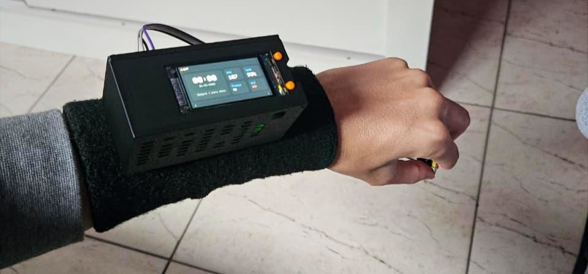
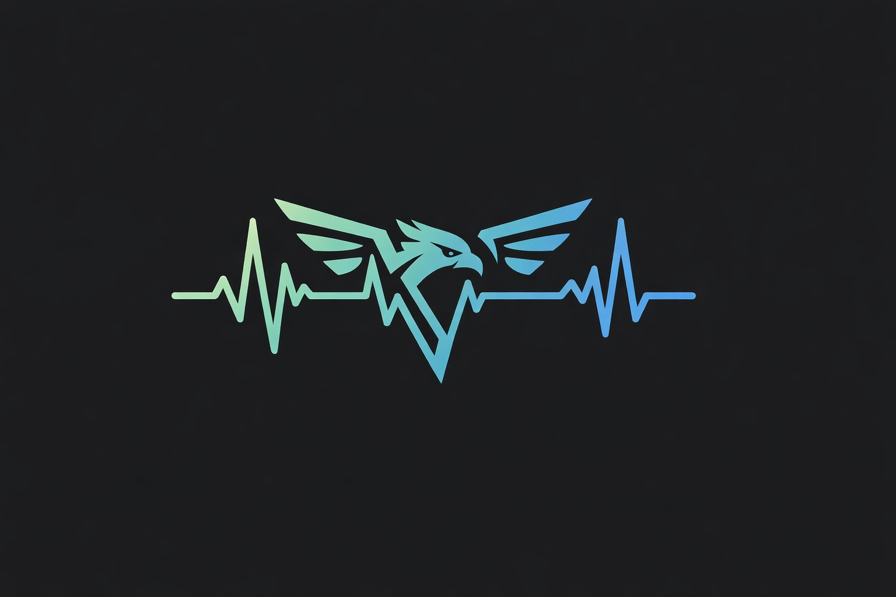
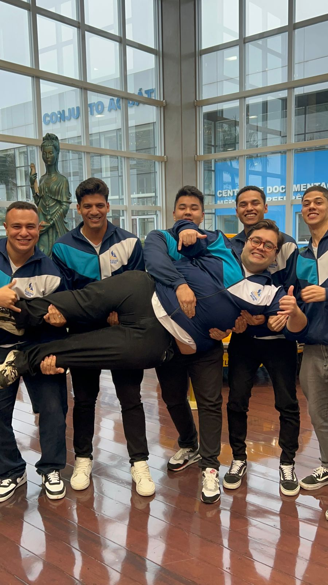
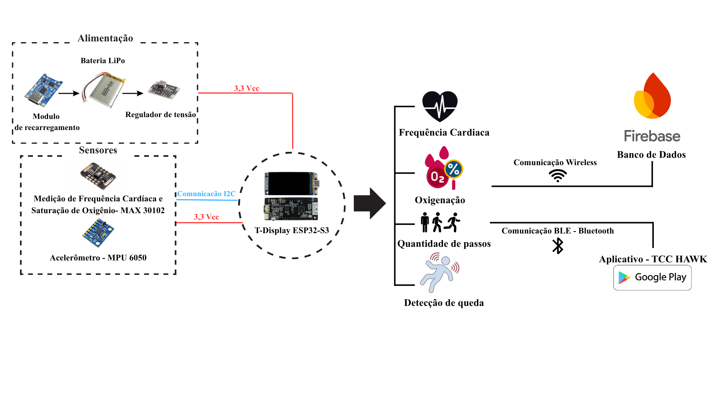
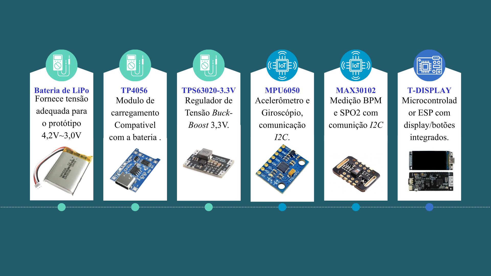
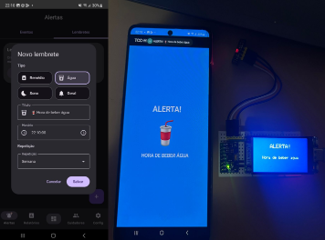
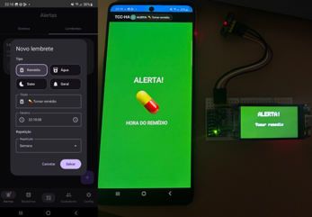
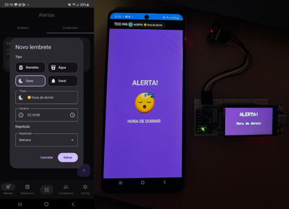
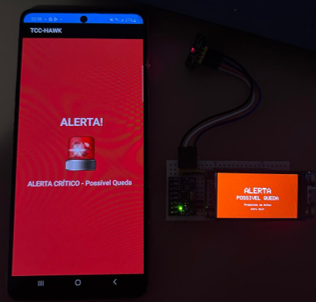

<div align="center">



# HAWK  
### Health Assistant Watch Kare

Sistema vestível para cuidado geriátrico com monitoramento de sinais vitais, detecção de quedas, comunicação BLE e aplicativo Android nativo.

</div>

<p align="center">
  
  
  
  
  
  
</p>

<p align="center">
  <a href="#visão-geral">Visão Geral</a> •
  <a href="#principais-funcionalidades">Funcionalidades</a> •
  <a href="#arquitetura-geral-do-sistema">Arquitetura</a> •
  <a href="#aplicativo-android">Aplicativo</a> •
  <a href="#como-executar-o-projeto">Como Executar</a>
</p>

## Visão Geral

O HAWK é um sistema de monitoramento geriátrico desenvolvido como Trabalho de Conclusão de Curso em Engenharia de Controle e Automação para Faculdade Engenheiro Salvador Arena. O projeto consiste em um dispositivo vestível, no formato de relógio inteligente, integrado a um aplicativo Android nativo. A solução foi criada com o objetivo de auxiliar no acompanhamento de idosos, permitindo a visualização de dados fisiológicos, monitoramento de movimento, detecção de quedas, emissão de alertas e futura integração com armazenamento em nuvem.

O sistema foi desenvolvido ao longo de aproximadamente seis meses, passando por etapas de prototipagem eletrônica, programação embarcada, desenvolvimento mobile, comunicação Bluetooth Low Energy, testes funcionais, documentação técnica e refinamento da interface.

O nome HAWK foi escolhido em referência ao falcão, símbolo de vigilância, atenção e resposta rápida. Essa ideia representa a proposta do sistema: acompanhar continuamente o usuário e gerar alertas em situações críticas.
<p align="center">
  
</p>

---

## Autores

Projeto desenvolvido como Projeto Final de Curso em Engenharia de Controle e Automação pela Faculdade Salvador Arena.

**Projeto HAWK – Health Assistant Watch Kare**

## Equipe de Desenvolvimento

Projeto desenvolvido como Projeto Final de Curso em Engenharia de Controle e Automação pela Faculdade Engenheiro Salvador Arena.

| Integrante | RA |
|---|---|
| Bruno Alves Guirado | 062210033 |
| Guilherme Fernando de Oliveira Bezerra | 062210038 |
| Guilherme do Nascimento de Souza | 062210016 |
| Lucas Guedes Pereira | 062210002 |
| Pedro Henrique Mateus Ribeiro | 062220039 |

<p align="center">
  
</p>

* Com aparição do nosso companheiro Vinicius Koiti, que felizmente não estava em nosso grupo.

---

## Objetivo do Projeto

O objetivo principal do projeto é desenvolver um dispositivo vestível capaz de monitorar parâmetros básicos de saúde e movimento de um usuário idoso, transmitindo essas informações para um aplicativo móvel Android. O sistema busca oferecer uma interface simples, intuitiva e acessível, permitindo que o usuário ou cuidador acompanhe dados como frequência cardíaca, saturação de oxigênio, passos, movimento, repouso e eventos de queda.

Além disso, o projeto foi estruturado para permitir futuras expansões, como armazenamento em nuvem, geração automática de relatórios, acesso por cuidadores e integração com banco de dados remoto.

---

## Principais Funcionalidades

O sistema implementa as seguintes funcionalidades:

| Categoria | Funcionalidades |
|---|---|
| Monitoramento | Frequência cardíaca, SpO₂, passos, movimento e repouso |
| Segurança | Detecção de queda, alerta sonoro, vibração e tela cheia |
| Comunicação | Bluetooth Low Energy entre relógio e aplicativo |
| Aplicativo | Dashboard, alertas, relatórios, cuidadores e configurações |
| Personalização | Cadastro do usuário, limites de BPM e SpO₂, lembretes de água, remédio e sono |
| Expansão | Estrutura preparada para integração com banco de dados em nuvem |

---

## Arquitetura Geral do Sistema

A arquitetura do HAWK é composta por duas camadas principais: o sistema embarcado e a aplicação móvel Android.

O sistema embarcado é responsável pela aquisição dos dados dos sensores, processamento local das informações, exibição no display do relógio, controle por botões físicos e comunicação BLE. Já o aplicativo Android atua como interface principal de visualização e controle, recebendo os dados do relógio, exibindo informações ao usuário, gerando alertas e preparando os dados para integração futura com a nuvem.

Fluxo geral:

```text
Sensores → ESP32-S3 → BLE → Aplicativo Android → Alertas / Relatórios / Nuvem
```

<p align="center">
  
</p>

---

## Hardware Utilizado

O protótipo foi desenvolvido utilizando os seguintes componentes principais:

* LilyGo T-Display ESP32-S3;
* Sensor MPU6050;
* Sensor MAX30102;
* Botões físicos para navegação;
* Conexão USB-C para alimentação e programação;
* Jumpers, soldagem e estrutura de montagem;
* Case/protótipo físico para acomodação dos componentes.
<p align="center">
  
</p>

---

## Firmware Embarcado

O firmware foi desenvolvido em C++ utilizando a Arduino IDE. A programação embarcada foi responsável por controlar os sensores, display, botões, lógica de telas, alertas locais e comunicação BLE.

O código embarcado foi estruturado com uma lógica modular, separando as principais responsabilidades do sistema. Entre as funções implementadas estão:

* Inicialização dos periféricos;
* Configuração da comunicação I2C;
* Leitura do MPU6050;
* Leitura do MAX30102;
* Cálculo de passos;
* Análise de movimento;
* Identificação de possível queda;
* Controle das telas do relógio;
* Controle de brilho;
* Recebimento de comandos BLE;
* Envio periódico de dados para o aplicativo.

A interface do relógio foi organizada por uma máquina de estados, permitindo alternância entre telas de horário, dados de saúde, passos, alertas e configurações. Essa abordagem facilitou a navegação por botões físicos e organizou melhor a atualização das informações no display.

---

## Sensores

### MPU6050

O MPU6050 foi utilizado para leitura de aceleração nos três eixos. A partir desses dados, o sistema realiza a análise de movimento, contagem de passos e identificação de possível queda.

A detecção de queda foi baseada na análise da variação de aceleração nos eixos X, Y e Z, identificando movimentos bruscos compatíveis com impacto. Quando o relógio identifica uma possível queda, envia ao aplicativo um sinal específico indicando o evento.

### MAX30102

O MAX30102 foi utilizado para estimativa de frequência cardíaca e saturação de oxigênio. As leituras dependem do contato adequado do sensor com a pele, sendo utilizadas no protótipo como valores indicativos. O módulo não possui validação clínica, sendo empregado com finalidade experimental e demonstrativa no contexto do projeto.

---

## Comunicação BLE

A comunicação entre o relógio e o aplicativo Android ocorre por Bluetooth Low Energy. O relógio atua como dispositivo periférico BLE, enquanto o celular atua como dispositivo central.

O fluxo implementado envolve:

1. Inicialização do relógio;
2. Abertura do aplicativo Android;
3. Busca pelo dispositivo BLE;
4. Conexão entre celular e relógio;
5. Descoberta dos serviços e características;
6. Habilitação de notificações;
7. Sincronização de data e hora;
8. Envio periódico dos dados do relógio para o aplicativo;
9. Envio de comandos do aplicativo para o relógio.

O payload enviado pelo relógio inclui informações como:

```text
BPM
SpO2
Passos
Queda
Aceleração X
Aceleração Y
Aceleração Z
Status do MPU
Status do sensor de dedo
```

O aplicativo interpreta esses dados e atualiza a interface em tempo real.

---

## Aplicativo Android

O aplicativo móvel foi desenvolvido em Kotlin utilizando Android Studio e Jetpack Compose. Ele foi projetado para ser a principal interface de interação do sistema, exibindo os dados recebidos do relógio e permitindo o gerenciamento de alertas, relatórios e configurações.

A arquitetura do aplicativo foi organizada em camadas:

* Interface gráfica em Jetpack Compose;
* ViewModels para controle de estado;
* Repositório para comunicação BLE;
* Modelos de dados;
* Sistema de alertas;
* Estrutura inicial para comunicação com nuvem.

---

## Telas do Aplicativo

O aplicativo possui as seguintes telas principais:

### Dashboard

A tela principal apresenta os principais dados monitorados pelo relógio:

* Frequência cardíaca;
* Saturação de oxigênio;
* Passos;
* Tempo em movimento;
* Tempo em repouso;
* Dados do acelerômetro;
* Status de queda;
* Status de conexão com o relógio;
* Relatório diário de saúde.

Os cards foram refinados para uma interface mais limpa, moderna e premium, com cores suaves, ícones, organização visual e atualização dinâmica dos dados.

### Alertas

A tela de alertas registra eventos importantes, como:

* Queda detectada;
* Batimento alto;
* Batimento baixo;
* Oxigenação baixa;
* Lembretes de hidratação;
* Lembretes de remédio;
* Lembretes de sono;
* Alertas gerais.

Os alertas críticos são exibidos em tela cheia, com som, vibração e notificação visual.

<p align="center">
  
  
  
</p>

### Relatórios

A tela de relatórios foi planejada para apresentar dados consolidados do usuário, como histórico de batimentos, SpO₂, passos, quedas e eventos críticos. A proposta é permitir acompanhamento diário, semanal e mensal.

### Cuidadores

A tela de cuidadores foi planejada para cadastrar responsáveis pelo usuário monitorado. A ideia é permitir o registro de nome, telefone, e-mail, relação com o paciente e prioridade de contato.

### Configurações

A tela de configurações reúne ajustes gerais do aplicativo e do relógio, como conexão BLE, sincronização de horário, testes de alerta, preferências do sistema e futuras opções de integração com nuvem.

### Cadastro do Usuário

O cadastro inicial coleta informações importantes do paciente, como:

* Nome;
* Data de nascimento;
* Peso;
* Altura;
* Sexo;
* Horários de sono;
* Mobilidade;
* Histórico de quedas;
* Hipertensão;
* Diabetes;
* Problemas cardíacos;
* Problemas respiratórios;
* Uso de medicação contínua;
* Limites personalizados de taquicardia e bradicardia;
* Limites de SpO₂;
* Contato de emergência;
* Observações médicas.

Essas informações permitem personalizar os alertas e melhorar o contexto do monitoramento.

---

## Alerta de Queda

O alerta de queda é uma das principais funcionalidades do projeto. Quando o relógio detecta uma possível queda, envia o status ao aplicativo por BLE. O aplicativo, ao identificar esse evento, executa as seguintes ações:

* Atualiza o card de acelerômetro/queda;
* Registra o evento na tela de alertas;
* Exibe uma tela cheia de alerta crítico;
* Emite som de alarme;
* Ativa vibração;
* Exibe notificação de alta prioridade.

Esse comportamento busca chamar a atenção do usuário ou cuidador em situações de risco.
<p align="center">
  
</p>

---

## Integração com Nuvem

Durante o desenvolvimento, foi estudada a integração com banco de dados em nuvem para armazenamento histórico dos dados. Foram avaliadas arquiteturas baseadas em MQTT, InfluxDB e Firebase.

A proposta final considerada para expansão do sistema foi utilizar o aplicativo Android como gateway entre o relógio e a nuvem. Nesse modelo, o relógio envia os dados por BLE ao celular, e o aplicativo organiza essas informações e as envia para uma plataforma em nuvem do Firebase.

Fluxo proposto:

```text
Relógio ESP32 → BLE → Aplicativo Android → Nuvem → Histórico / Relatórios / Cuidadores
```

Para telemetria IoT, o uso de MQTT com banco de séries temporais é uma possibilidade futura. Para integração mais rápida com autenticação, múltiplos dispositivos e sincronização de dados, o Firebase foi considerado uma alternativa adequada.

---

## Testes Realizados

Durante o desenvolvimento foram realizados testes funcionais envolvendo:

* Comunicação BLE entre relógio e celular;
* Sincronização de data e hora;
* Envio de dados do relógio para o aplicativo;
* Atualização dos cards no dashboard;
* Leitura do acelerômetro;
* Detecção de movimento;
* Testes de queda;
* Alertas em tela cheia;
* Vibração e som em eventos críticos;
* Alertas de BPM e SpO₂;
* Funcionamento dos lembretes;
* Testes de interface;
* Validação do payload BLE com nRF Connect.

O nRF Connect foi utilizado como ferramenta auxiliar para verificar serviços BLE, características e dados transmitidos pelo relógio.

---

## Tecnologias Utilizadas

### Firmware

* C++;
* Arduino IDE;
* Arduino GFX;
* Bibliotecas para BLE;
* Bibliotecas para sensores MPU6050 e MAX30102.

### Aplicativo Android

* Kotlin;
* Android Studio;
* Jetpack Compose;
* ViewModel;
* StateFlow;
* Bluetooth Low Energy;
* AlarmManager;
* NotificationManager;
* MediaPlayer;
* Vibrator.

### Ferramentas de Teste e Apoio

* nRF Connect;
* Serial Monitor;
* Serial Plotter;
* GitHub;
* Mermaid;
* Word/PowerPoint para documentação e apresentação.

---

## Protocolo de Dados

O relógio envia os dados em formato textual estruturado, utilizando pares chave-valor. O aplicativo interpreta esse payload e converte os dados para estruturas internas.

Exemplo conceitual de payload:

```text
BPM:80;SPO2:97;P:1200;Q:0;X:0.12;Y:-0.04;Z:0.98;MPU:1;F:1;
```

Campos principais:

* `BPM`: frequência cardíaca;
* `SPO2`: saturação de oxigênio;
* `P`: passos;
* `Q`: status de queda;
* `X`, `Y`, `Z`: aceleração;
* `MPU`: status do acelerômetro;
* `F`: detecção do dedo no sensor óptico.

---

## Resultados Obtidos

O projeto resultou em um protótipo funcional composto por relógio vestível e aplicativo Android. O sistema foi capaz de realizar comunicação BLE, transmitir dados dos sensores, atualizar a interface do aplicativo, gerar alertas e registrar eventos críticos.

Entre os principais resultados obtidos estão:

* Funcionamento da comunicação BLE bidirecional;
* Sincronização de horário do celular para o relógio;
* Exibição dos dados no dashboard;
* Alertas visuais e sonoros no celular;
* Detecção e registro de queda;
* Interface mobile refinada;
* Estrutura modular do firmware;
* Separação das camadas do aplicativo;
* Preparação para integração com banco de dados em nuvem.

---

## Limitações

O projeto apresenta algumas limitações:

* O MAX30102 não possui validação clínica no protótipo;
* A detecção de queda utiliza limiares e lógica simplificada;
* A contagem de passos é experimental;
* A comunicação BLE depende da proximidade entre celular e relógio;
* A integração em nuvem foi estruturada como proposta de expansão;
* O protótipo ainda não possui case final industrializado;
* O consumo de bateria ainda pode ser otimizado.

---

## Possibilidades Futuras

Como melhorias futuras, destacam-se:

* Integração completa com Firebase ou banco em nuvem;
* Login com conta Google;
* Acesso remoto por cuidadores;
* Geração automática de relatórios mensais;
* Envio automático de relatórios por e-mail;
* Aplicação de filtros digitais nos dados do acelerômetro;
* Melhoria do algoritmo de detecção de queda;
* Calibração individual dos sensores;
* Otimização de bateria;
* Desenvolvimento de case final impresso em 3D;
* Integração com serviços de emergência;
* Armazenamento histórico em banco de dados;
* Notificações remotas para familiares.

---

## Estrutura do Repositório

```text
TCC-HAWK/
│
├── firmware/
│   └── esp32_hawk_watch/
│       ├── esp32_hawk_watch.ino
│       ├── alerts.cpp
│       ├── alerts.h
│
├── android/
│   └── TCC_HAWK/
│        ├── build.gradle.kts
│        ├── settings.gradle.kts
│        ├── gradle.properties
│        ├── gradlew
│        ├── gradlew.bat
│        ├── gradle/
│        │   ├── libs.versions.toml
│        │   └── wrapper/
│        │       ├── gradle-wrapper.jar
│        │       └── gradle-wrapper.properties
│        │
│        └── app/
│            ├── build.gradle.kts
│            ├── proguard-rules.pro
│            │
│            └── src/
│                ├── main/
│                │   ├── AndroidManifest.xml
│                │   │
│                │   ├── java/com/example/tcc_hawk/
│                │   │   ├── MainActivity.kt
│                │   │   │
│                │   │   ├── data/
│                │   │   │   ├── alarms/
│                │   │   │   │   ├── AlarmReceiver.kt
│                │   │   │   │   └── AlarmScheduler.kt
│                │   │   │   │
│                │   │   │   ├── ble/
│                │   │   │   │   └── HawkBleUuids.kt
│                │   │   │   │
│                │   │   │   ├── local/
│                │   │   │   │   ├── PreferencesStore.kt
│                │   │   │   │   └── ThemePrefs.kt
│                │   │   │   │
│                │   │   │   ├── model/
│                │   │   │   │   ├── Models.kt
│                │   │   │   │   └── PatientProfile.kt
│                │   │   │   │
│                │   │   │   ├── mqtt/
│                │   │   │   │   └── MqttManager.kt
│                │   │   │   │
│                │   │   │   └── repository/
│                │   │   │       ├── HawkRepository.kt
│                │   │   │       ├── RepositoryProvider.kt
│                │   │   │       ├── ble/
│                │   │   │       │   └── BleHawkRepository.kt
│                │   │   │       └── fake/
│                │   │   │           └── FakeHawkRepository.kt
│                │   │   │
│                │   │   └── ui/
│                │   │       ├── components/
│                │   │       │   ├── DatePickerField.kt
│                │   │       │   └── TimePickerField.kt
│                │   │       │
│                │   │       ├── navigation/
│                │   │       │   └── AppNav.kt
│                │   │       │
│                │   │       ├── screens/
│                │   │       │   ├── alerts/
│                │   │       │   │   ├── AlertFullScreenActivity.kt
│                │   │       │   │   ├── AlertsFullScreen.kt
│                │   │       │   │   └── AlertsScreen.kt
│                │   │       │   │
│                │   │       │   ├── auth/
│                │   │       │   │   └── AuthScreen.kt
│                │   │       │   │
│                │   │       │   ├── caregivers/
│                │   │       │   │   └── CaregiversScreen.kt
│                │   │       │   │
│                │   │       │   ├── dashboard/
│                │   │       │   │   └── DashboardScreen.kt
│                │   │       │   │
│                │   │       │   ├── main/
│                │   │       │   │   └── MainScreen.kt
│                │   │       │   │
│                │   │       │   ├── onboarding/
│                │   │       │   │   └── OnboardingScreen.kt
│                │   │       │   │
│                │   │       │   ├── reports/
│                │   │       │   │   └── ReportsScreen.kt
│                │   │       │   │
│                │   │       │   ├── settings/
│                │   │       │   │   ├── SettingsScreen.kt
│                │   │       │   │   └── SettingsViewModel.kt
│                │   │       │   │
│                │   │       │   └── splash/
│                │   │       │       └── SplashScreen.kt
│                │   │       │
│                │   │       ├── state/
│                │   │       │   └── DashboardUiState.kt
│                │   │       │
│                │   │       ├── theme/
│                │   │       │   ├── AppThemeState.kt
│                │   │       │   ├── Color.kt
│                │   │       │   ├── Theme.kt
│                │   │       │   └── Type.kt
│                │   │       │
│                │   │       └── viewmodel/
│                │   │           ├── AlertsViewModel.kt
│                │   │           └── DashboardViewModel.kt
│                │   │
│                │   └── res/
│                │       ├── drawable/
│                │       │   ├── hawk_logo.png
│                │       │   ├── hawk_logo_background.xml
│                │       │   ├── ic_launcher_background.xml
│                │       │   └── ic_launcher_foreground.xml
│                │       │
│                │       ├── mipmap-*/
│                │       │   ├── hawk_logo.webp
│                │       │   ├── hawk_logo_foreground.webp
│                │       │   ├── hawk_logo_round.webp
│                │       │   ├── ic_launcher.webp
│                │       │   ├── ic_launcher_foreground.webp
│                │       │   └── ic_launcher_round.webp
│                │       │
│                │       ├── values/
│                │       │   ├── colors.xml
│                │       │   ├── ic_launcher_background.xml
│                │       │   ├── strings.xml
│                │       │   └── themes.xml
│                │       │
│                │       └── xml/
│                │           ├── backup_rules.xml
│                │           └── data_extraction_rules.xml
│                │
│                ├── androidTest/
│                │   └── java/com/example/tcc_hawk/
│                │       └── ExampleInstrumentedTest.kt
│                │
│                └── test/
│                    └── java/com/example/tcc_hawk/
│                        └── ExampleUnitTest.kt
│
├── docs/
│   ├── fluxogramas/
│       ├── logica_funcionamento.png
│       ├── detecção_queda.png
│   ├── imagens/
│       ├── diagrama_funcional.png
│       ├── softwares.png
│       ├── testes.png
│       ├── componentes.png
│       ├── protótipo_final.jpg
│       ├── protótipo_inicial.jpg
│       ├── montagem_protótipo.jpg
│       ├── dispositivo_vestivel.jpg
│       ├── theMans.jpeg
│       ├── hora_de_dormir.png
│       ├── medicação.png
│       ├── hidratação.png
│       ├── queda.png
│   └── artigo/
│       ├── PFC_Desenvolvimento de um dispositivo vestível para cuidado geriátrico com integração IoT - V2.2
│
├── esquematicos/
│   └── eletronico/
│       ├── eletronico.kicad_sch/
│   └── mecanico/
│       └── OldVersions/
│           ├── carcaça final.0017.ipt
│           ├── montagem_final_v2.0001.iam
│           ├── tampa final.0012.ipt
│       ├── botão final.ipt
│       ├── botão final.stl
│       ├── carcaça final.ipt
│       ├── carcaça final.stl
│       ├── Montagem_final.iam
│       ├── montagem_final_v2.iam
│       ├── tampa final.ipt
│       ├── tampa final.stl
│ 
└── README.md
```

---

## Como Executar o Projeto

### Firmware

1. Abrir o código do firmware na Arduino IDE;
2. Selecionar a placa ESP32-S3 correspondente;
3. Instalar as bibliotecas necessárias;
4. Conectar o dispositivo via USB-C;
5. Compilar e enviar o código para o relógio.

### Aplicativo Android

1. Abrir o projeto no Android Studio;
2. Sincronizar as dependências Gradle;
3. Conectar um smartphone Android;
4. Conceder permissões de Bluetooth, localização e notificações;
5. Executar o aplicativo;
6. Ligar o relógio;
7. Realizar a conexão BLE pelo app.

---
## Observação

O sistema desenvolvido possui finalidade acadêmica e experimental. Os dados fisiológicos apresentados são indicativos e não substituem equipamentos médicos certificados ou avaliação profissional. O projeto tem como objetivo demonstrar a integração entre sistemas embarcados, sensores, comunicação IoT e aplicação móvel no contexto de cuidado geriátrico.
